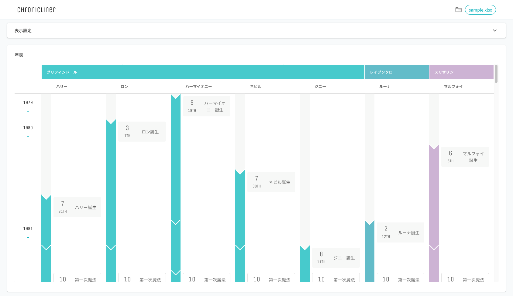

.. Chronicliner documentation master file, created by
   sphinx-quickstart on Fri Feb  4 14:36:50 2022.
   You can adapt this file completely to your liking, but it should at least
   contain the root `toctree` directive.

========================================
Welcome to Chronicliner's documentation!
========================================

Chroniclinerは、キャラの年齢やら学年やら時系列がわからなくなった限界同人オタク&クリエイターのために作成された年表ツールです。

目次
===============
.. toctree::
   :maxdepth: 2
   :caption: INFO:

   ./source/info/quickstart
   ./source/info/files
   ./source/info/update
   ./source/info/require
   ./source/info/caution

.. toctree::
   :maxdepth: 2
   :caption: DATA SETTING:

   ./source/data/category
   ./source/data/character
   ./source/data/school
   ./source/data/event

